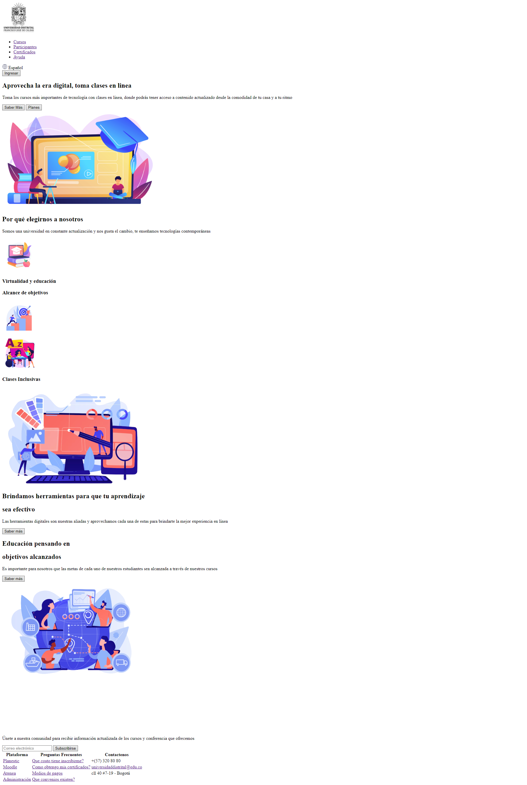
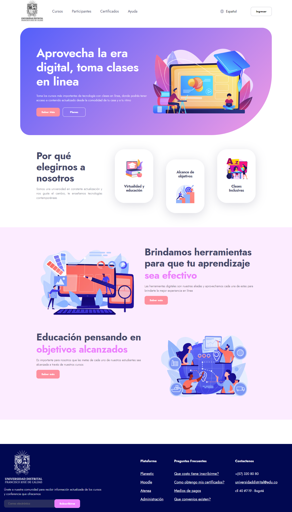

<h1>Taller 9: Jose Vargas</h1>

<h2>Informacion</h2>

Curso: Full Stack Basico -Grupo 1

Profesor: Cristian Patiño

<h2>Punto 1: Link de figma<h2>
<a href="https://www.figma.com/file/LdDbZ60kHBIrGAsXtD0alp/Untitled?type=design&node-id=0%3A1&t=zcrDorKwjPS02DMi-1" target="_blank">Link de Figma</a>

 <h2>Punto 2: HTML</h2>
 

 <h2>Punto 3: CSS </h2>
 

 <h3><a href="https://snikyx.github.io/taller-9-full-stack/" target="_blank">Link Pagina Web</a></h3>